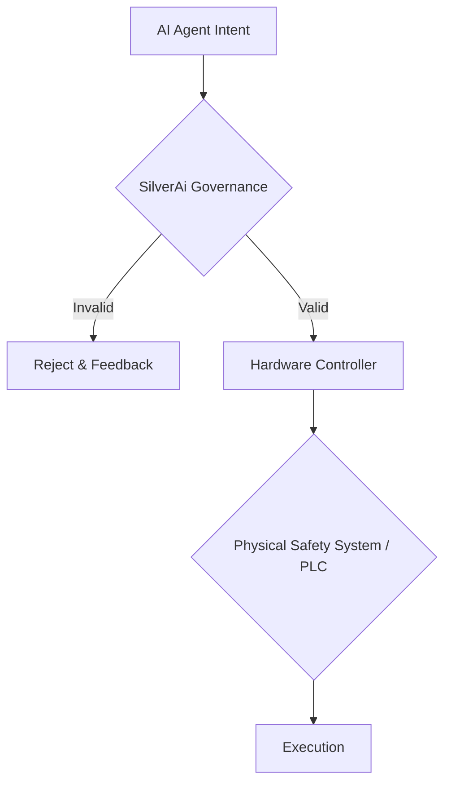
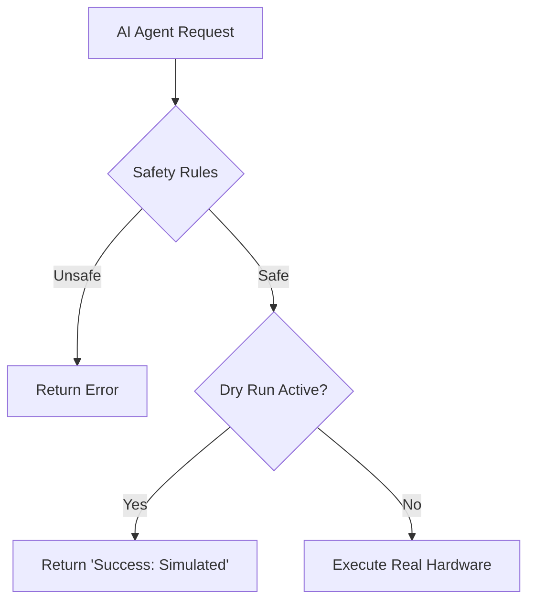

# 🛡️ SilverAi

**Deterministic Pre-flight validation for AI agents controlling hardware.**

[](https://pypi.org/project/silver-ai/)
[](https://www.python.org/downloads/)
[](https://github.com/gcl-team/SilverAi/blob/main/LICENSE)
[](https://piwheels.org/project/silver-ai/)
[](https://github.com/gcl-team/SilverAi/actions/workflows/ci.yaml)

> **A governance layer to catch AI agent mistakes before they reach your hardware.**

## 🚨 The Problem

Large Language Models (LLMs) are probabilistic, but hardware is deterministic. SilverAi is a lightweight Python middleware that acts as a "bouncer at the door". It validates Agent requests against the current state snapshot of your system before execution, preventing obvious hallucinations from becoming physical actions.

### Where SilverAi Helps

* **Smart Home/Office Automation**: Preventing agents from triggering devices during "do not disturb" modes;
* **Warehouse Batch Operations**: Validating battery and connectivity status before starting a non-critical routine;
* **Prototyping & Development**: Making the development of Agentic IoT safer by catching logic errors early.

## ⚡ The Solution

**SilverAi** is a lightweight, dependency-free Python middleware that enforces **pre-flight validation** on the tools of your AI agent. It sits between the LLM intent and the execution of your system.

### ✨ Key Features
*   **🐍 Pythonic Decorators:** Clean, readable syntax using `@guard`.
*   **🔌 Connectivity Gates:** Prevents Agents from calling APIs when the device is offline (`BLE`, `WiFi`).
*   **🔋 State-Aware:** Validates against real-time telemetry (Battery, Heat) before execution.
*   **🧪 Dry-Run Mode:** Test your safety logic in CI/CD without requiring physical hardware or live APIs.

---

## 🚀 Quick Start

### Installation
```bash
pip install silver-ai
```

### Usage: Protecting a Robot

Prevent an Agent from moving a robot if the battery is critical or the connection is unstable.

```python
from silver_ai import guard, rules

class IndustrialRobot:
    def __init__(self):
        # In production, this state comes from live telemetry
        self.state = {
            "battery": 10, 
            "connection": "offline",
            "is_stuck": False
        }

    @guard(
        rules.BatteryMin(15),
        rules.RequireConnectivity(protocol="BLE")
        # rules.TransactionLimit(amount=50)
    )
    def start_operation(self, zone: str):
        # 🛑 This code NEVER runs because battery (10) < 15
        # AND the device is offline.
        hardware_driver.move_to(zone)
```

The Agent receives this structured rejection (instead of crashing):

```json
{
  "status": "error",
  "reason": "Battery critical: 10%. Required: 15%.",
  "suggestion": "Connect device to charger before proceeding.",
  "dry_run": false
}
```

## 🏛️ Architecture

SilverAi is part of a **Defense-in-Depth** strategy. It validates agent intent so your lower-level systems do not have to.


```mermaid
graph TD
    A[AI Agent Intent] --> B{SilverAi Governance}
    B -- Invalid --> C[Reject & Feedback]
    B -- Valid --> D[Hardware Controller]
    D --> E{Physical Safety System / PLC}
    E --> F[Execution]
```

## 🧪 Simulation & Testing (No Hardware Required)

One of the hardest parts of IoT development is testing failure states (e.g., "What happens if the battery dies halfway?"). SilverAi provides a DryRun harness to test safety logic instantly.


```mermaid
graph TD
    Start[AI Agent Request] --> Check{Safety Rules}
    Check -- Unsafe --> Fail[Return Error]
    Check -- Safe --> Mode{Dry Run Active?}
    Mode -- Yes --> Dry[Return 'Success: Simulated']
    Mode -- No --> Real[Execute Real Hardware]
```

```python
from silver_ai.core import DRY_RUN_FLAG
from my_robot import IndustrialRobot

def test_safety_stops_low_battery():
    # 1. Instantiate the robot
    robot = IndustrialRobot()
    
    # 2. Inject dangerous state
    robot.state = {"battery": 5, "connection": "online"}
    
    # 3. Enable Safety Override (Dry Run)
    # We manually flag this instance for simulation
    setattr(robot, DRY_RUN_FLAG, True)
    
    # 4. Run the function
    result = robot.start_operation("Zone A")
    
    # 5. Assert that SilverAi caught it
    assert result['status'] == 'error'
    assert "Battery" in result['reason']
```

## 🛠️ Development on Local Machine

This project uses **Poetry** for dependency management and **Ruff** for strict code quality.

### 1. Prerequisites
* **Python 3.13+** (the demo requires Python 3.13 due to Phoenix/greenlet compatibility; the core library supports 3.13+);
* [Poetry](https://python-poetry.org/docs/) installed.
  ```bash
  pip install poetry
  ```

### 2. Setup
Clone the repo and install dependencies (including the virtual environment):
```bash
git clone https://github.com/gcl-team/SilverAi.git
cd SilverAi
poetry install
```

If you want the Phoenix-backed demo dependencies, install the optional demo group on Python 3.13:

```bash
poetry install --with demo
```

If you need to explicitly use Python 3.13, run:

```bash
poetry env use python3.13
```

### 3. Running the Demo
We provide a `demo.py` to showcase the behavior (Success, Failure, Dry Run, Exception).
```bash
poetry run python demo.py
```

### 4. Running 
We use pytest for unit testing.
```bash
poetry run pytest
```

### 5. Linting & Security
We use ruff to enforce PEP8, import sorting, and Bandit security rules.
```bash
poetry run ruff format .
poetry run ruff check .
```

### 6. Version Bump (Maintainers)
Use Poetry to update the package version in `pyproject.toml`.

```bash
# bump 0.1.8 -> 0.1.9
poetry version patch

# bump 0.1.8 -> 0.2.0
poetry version minor

# bump 0.1.8 -> 1.0.0
poetry version major

# set an explicit version
poetry version 0.1.9

# verify current version
poetry version
```

## ⚠️ Important Limitations (Read Before Use)
SilverAi is a **Software Governance Layer**, not a real-time safety system.

* **Not for Real-Time**: Adds ~50-200ms latency. Works best for batch operations and control loops >500ms;
* **Pre-flight only**: Validates the intent before execution. It does not provide continuous monitoring during the action;
* **Defense-in-Depth**: SilverAi should be one layer of many. It does not replace hardware-level E-stops or PLC safety logic.

❌ **NEVER Use for**: Automotive, Medical Devices, Collision Avoidance, or any system where failure results in injury.

## 🤝 Contributing
We welcome your contributions! Bug reports and feature suggestions are encouraged. 
Open issues or submit pull requests via [Project Issues](https://github.com/gcl-team/SilverAi/issues).
